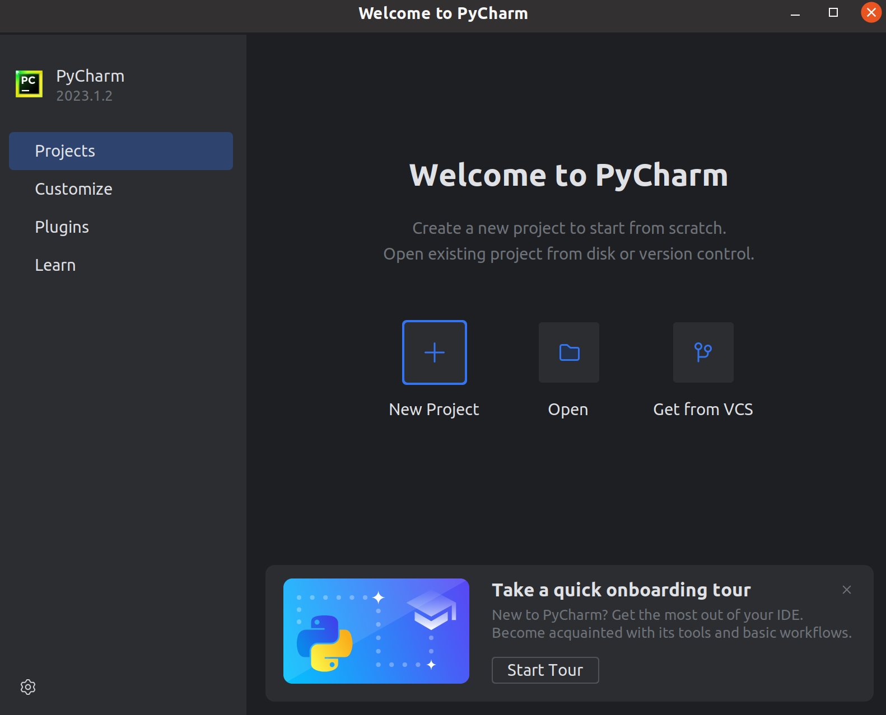
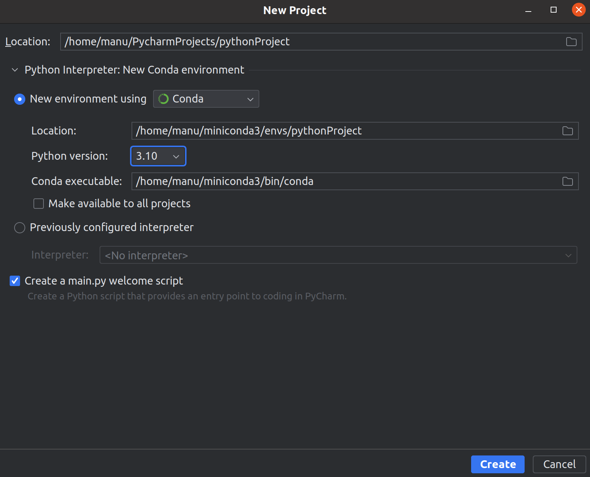
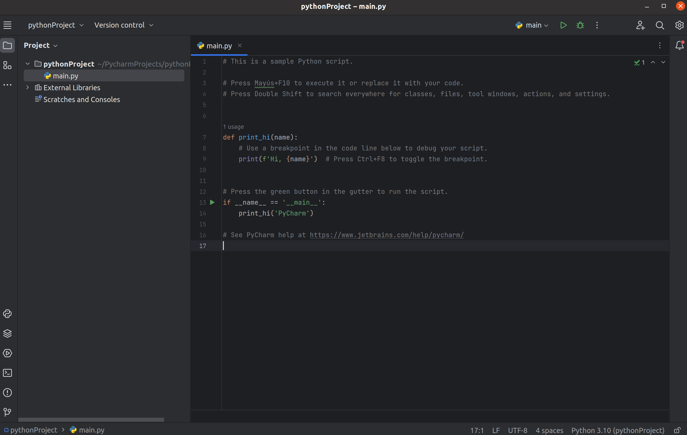
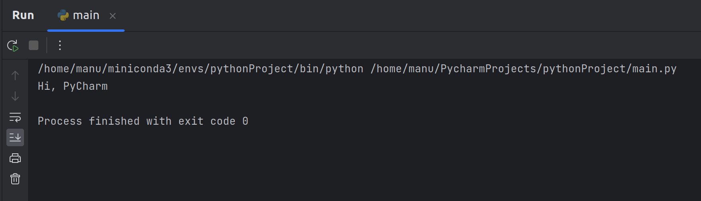

[`Procesamiento de datos con Python`](../../Readme.md) > [`Sesión 01`](../Readme.md) > `Ejemplo 1`

# Ejemplo 1: Conociendo PyCharm

## 1. Objetivos :dart:

- Repasar rápidamente cómo funciona **PyCharm** para poner en práctica lo que vimos en el Prework.

## 2. Requisitos :clipboard:

1. **PyCharm** instalado.

## 3. Desarrollo :rocket:

1. Busca en tu directorio de aplicaciones **PyCharm** y ejecútalo.

1. Cuando éste se abra verás una pantalla similar a la que sigue. Es posible que cambie dependiendo de tu sistema operativo, en este ejemplo estamos usando la distribución **Ubuntu** de **Linux**; sin embargo no debería cambiar mucho si usas otro sistema operativo.

    

    Selecciona el botón con el ícono de `+` llamado *New Project* lo cual iniciará un nuevo proyecto. Para la mayoría de ejemplos y retos del módulo, tendrás que replicar esta acción al iniciar o abrir proyecto previamente hecho para ti en algunos casos.

    Despúés de presionar este botón verás la siguiente pantalla:

    

    En la sección *New evironment using* selecciona *Conda* (el cuál deberás tener previamente instalado). Es importante que lo tengas configurado pues a partir de éste instalaremos nuevos paquetes a lo largo del módulo. Las instrucciones de configuración se encuentran en el Prework.

    Deja además selecciona la casilla *Create a `main.py` welcome script* para realizar una prueba rápida.

    Finalmente presiona el botón *Create*, lo cuál después de configurarse y cargar, abrirá la siguiente ventana:

    

1. El proyecto que configuramos tiene un *script* escrito en **Python**. Esta sección es un editor de texto, ahí escribiremos todos nuestros programas, jugaremos en gran medida con esta parte **PyCharm**. De momento basta con que sepas que ahí se escriben los programas.

1. Para ejecutar nuestros programas presiona el botón ▶ verde junto al texto `main`. Observa los resultados.

    

**¡Felicidades! Has ejecutado tu primer *script* de Python**

Aprenderemos a lo largo de estas sesiones definir tus propios *scripts*.

[`Anterior`](../Readme.md) | [`Siguiente`](../Readme.md)

