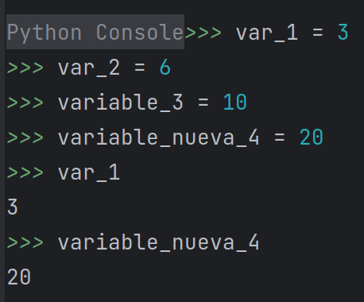
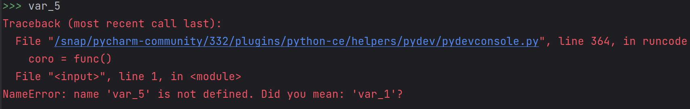

[`Procesamiento de datos con Python`](../../Readme.md) > [`Sesión 01`](../Readme.md) > `Ejemplo 2`

# Ejemplo 2: Variables

<div style="text-align: justify;">

## 1. Objetivos :dart:

- Entender cuál es la sintaxis de la asignación de variables en **Python**.
- Aprender la convención de nombrado de variables.

## 2. Requisitos :clipboard:

1. **PyCharm** instalado.

## 3. Desarrollo :rocket:

1. Los siguientes son nombres válidos de variables en **Python**:

    - `var_1`
    - `variable_2`
    - `variable_dos`
    - `variable_nueva_3`
    - `esta_es_una_variable_nueva`

    Los siguientes son nombres inválidos para una variable de **Python**:

    - `1_2`
    - `1_variable`
    - `variableDos`
    - `EstaEsUnaVariable`
    - `So una variable`

1. Asignemos unas cuantas variables a continuación. Abre el intérprete y teclea las siguientes declaraciones. No olvides
presionar `Intro` después de cada asignación.

    ```python
    var_1 = 3
    var_2 = 6
    variable_3 = 10
    variable_nueva_4 = 20
    ```

1. Podemos acceder a su contenido con tan solo escribir el nombre de la variable y teclear `Intro`.

    

1. Si intentamos llamar a una variable que no hemos asignado, el intérprete lanza un error.

    


Es hora de que practiques...


[`Anterior`](../Readme.md) | [`Siguiente`](../Reto-01/README.md)

</div>