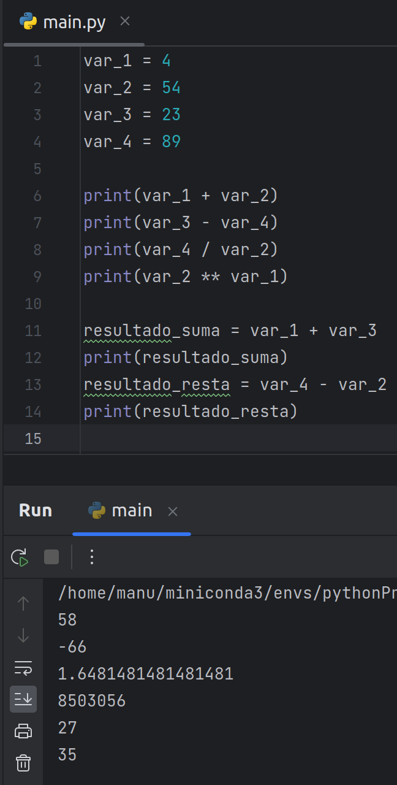

[`Procesamiento de datos con Python`](../../Readme.md) > [`Sesión 01`](../Readme.md) > `Ejemplo 3`

# Ejemplo 3: Operaciones numéricas

<div style="text-align: justify;">

## 1. Objetivos :dart:

- Mostrar cómo usar los operadores aritméticos.
- Practicar asignación de variables y la salida del intérprete.

## 2. Requisitos :clipboard:

1. **PyCharm** instalado.

## 3. Desarrollo :rocket:

1. Primero, colocaremos unas cuantas líneas en un *script*:

    ```python
    var_1 = 4
    var_2 = 54
    var_3 = 23
    var_4 = 89
    ```

    Para realizar operaciones numéricas con estas variables, basta con escribir la operación y ejecutarla. Para mostrar la
    salida cuando se ejecute el *script* usaremos la operación `print`.

    ```python
    print(var_1 + var_2)
    print(var_3 - var_4)
    print(var_4 / var_2)
    print(var_2 ** var_1)
    ```

    También podemos asignar los resultados de nuestras operaciones a otras variables:

    ```python
    resultado_suma = var_1 + var_3
    print(resultado_suma)

    resultado_resta = var_4 - var_2
    print(resultado_resta)
    ```

    

¡Hola de prácticar! Descarga el *script* anterior [**aquí**](codigo/main.py).

[`Anterior`](../Readme.md) | [`Siguiente`](../Readme.md)

</div>