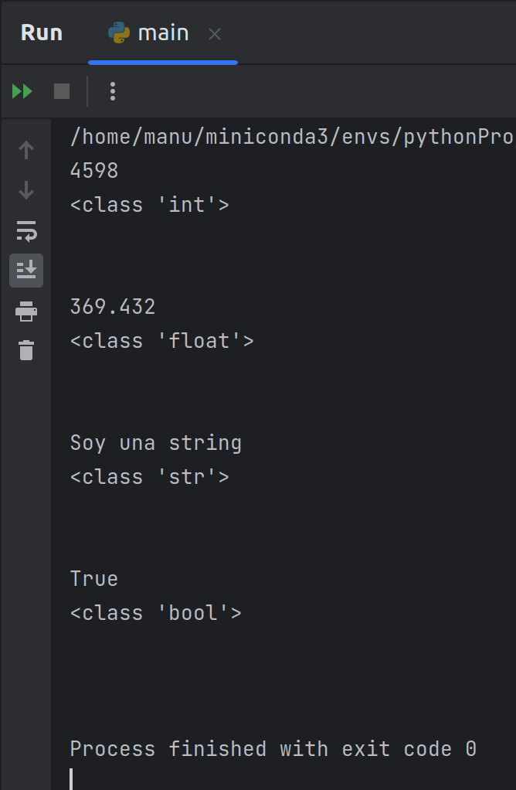

[`Procesamiento de datos con Python`](../../Readme.md) > [`Sesión 01`](../Readme.md) > `Ejemplo 4`

# Ejemplo 4: Tipos de datos

<div style="text-align: justify;">

## 1. Objetivos :dart:

- Hablar sobre los 4 tipos de datos básicos que tiene **Python**.

## 2. Requisitos :clipboard:

1. **PyCharm** instalado.

## 3. Desarrollo :rocket:

1. Tenemos 4 tipos de datos básicos. Veámoslos en código y usemos las funciones `print` y `type` para imprimir los tipos de manera explícita.

    ```python
    # Este es un número entero

    var_int = 4598

    print(var_int)
    print(type(var_int))
    print("\n")

    # Este es un número decimal

    var_float = 369.432

    print(var_float)
    print(type(var_float))
    print("\n")

    # Esta es una string

    var_string = "Soy una string"

    print(var_string)
    print(type(var_string))
    print("\n")

    # Este es un booleano

    var_bool = True

    print(var_bool)
    print(type(var_bool))
    print("\n")
    ```

    
    

[`Anterior`](../Readme.md) | [`Siguiente`](../Reto-02/README.md)

</div>