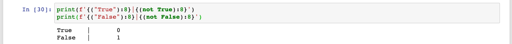

# Sesión 03: Programación funcional, operadores lógicos y funciones lambda


<div style="text-align: justify;">

## 1. Objetivos

1. Usar las dos funciones más importantes de la programación funcional: `map` y `filter`.
2. Utilizar operadores para extender la funcionalidad de nuestros operadores de comparación.
3. Conocer la sintaxis de las funciones `lambda` para simplificar la definición de funciones.

## 2. Contenido

---

### <ins>Programación Funcional</ins>


Aprendimos en el Prework que la programación funcional es un estilo de programación. Básicamente, es un conjunto de herramientas, métodos y reglas que sirven para organizar nuestro código y darle coherencia.

En este curso no nos interesan los detalles de la programación funcional, pero vamos a aprender a usar dos de sus funciones más comunes: `map` y `filter`. ¿Por qué? Porque la manera como funcionan se parece mucho a la manera como programan los científicos de datos.

Entendiendo `map` y `filter` al 100 te será más fácil aproximarte a las funciones universales en `numpy` y `pandas` y a cómo funcionan sus filtros.

¡Vamos adelante!

---

### <ins>`map`</ins>


La primera función que vamos a aprender es la función `map`. Dicha función toma una función y una lista y nos regresa una nueva lista donde la función a sido aplicada a cada elemento de la lista original:

Veamos cómo funciona.

- [**`Ejemplo 1`**](Ejemplo-01/README.md)
- [**`Reto 1`**](Reto-01/README.md)

---

### <ins>`filter`</ins>


Nuestra segunda función se llama `filter`. Tal y como su nombre lo dice, `filter` nos ayuda a filtrar elementos que no queremos de la lista.

`filter` recibe una función que regrese `True` o `False` y una lista. Después aplica la función elemento por elemento a la lista. Cada vez que la función regrese `True`, el elemento se queda en la nueva lista; cuando la función regrese `False`, el elemento es descartado.


Veamos a detalle cómo funciona.

- [**`Ejemplo 2`**](Ejemplo-02/README.md)
- [**`Reto 2`**](Reto-02/README.md)

---

### <ins>`and`</ins>


Hasta ahora sólo hemos utilizado `filter` con una función (una sola condición) para filtrar nuestra lista. ¿Pero qué pasa si queremos usar múltiples condiciones? Aquí es donde entran los operadores lógicos, que nos permiten unir dos sentencias de comparación. El primero es el operador `and`, que regresa `True` cuando las dos comparaciones que está uniendo regresan `True`, y `False` en todos los demás casos:

Vayamos ahora a algunos ejemplos.

- [**`Ejemplo 3`**](Ejemplo-03/README.md)
- [**`Reto 3`**](Reto-03/README.md)

---

### <ins>`or`</ins>


`or` es muy parecido a `and`. También nos sirve para unir dos sentencias de comparación y obtener un nuevo resultado. La diferencia es que `or` regresa `True` cuando **una de las dos o ambas** comparaciones regresen `True`:

Vayamos a algunos ejemplos.

- [**`Ejemplo 4`**](Ejemplo-04/README.md)
- [**`Reto 4`**](Reto-04/README.md)

---

<ins>`not`</ins>

`not` simplemente regresa el `booleano` opuesto al que recibe

<div style="padding: 10px; margin: 20px"></div>

Vamos a ver cómo funciona

>

[**`Ejemplo 5`**](Ejemplo-05/not.ipynb)

---

<ins>Funciones `lambda`</ins>

Las funciones `lambda` son simplemente una manera distinta de declarar nuestras funciones. Tienen el mismo comportamiento de una función, pero una sintaxis y capacidades simplificadas. Se ven así:

```python
lambda x: x * 100
```

Veámoslas en funcionamiento.

>

[**`Ejemplo 6`**](Ejemplo-06/lambda.ipynb)
[**`Reto 5`**](Reto-05/lambda.ipynb)

---

### 3. Postwork

[**`Postwork Sesión 3`**](Postwork/Readme.md)
