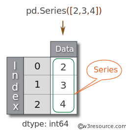

# Sesión 04: Pandas y Análisis Exploratorio de Datos


<div style="text-align: justify;">

## 1. Objetivos

1. Identificar las características básicas de las Series y DataFrames de Pandas.
2. Leer JSONs usando Pandas.
3. Utilizar herramientas básicas de exploración de datos.

## 2. Contenido

---

### <ins>Paquetes</ins>


Previo a que podamos trabajar con el material de esta sesión es importante que aprendas a instalar paquetes en el ambiente de desarrollo que configura **PyCharm**. Recuerda que en la primera sesión elegimos **Conda** como gestor de paquetes. De esta forma, necesitarás abrir la termina de **PyCharm** y ejecutar los siguientes comandos:

```bash
> conda install pip
> pip install pandas
```

En general y de aquí adelante, ya no deberás ejecutar el primer comando, pero sí usarás bastante el comando `pip` para instalar otros paquetes. El repositorio te guiará con estas instrucciones.

---


### <ins>Series de Pandas</ins>


Las series son una de las dos estructuras de datos que ofrece Pandas que nos hacen la vida mucho más fácil como científicos de datos.

Las series son una especie de híbrido entre `listas` y `diccionarios`.

Vamos a ver cómo funcionan.

- [**`Ejemplo 1`**](Ejemplo-01/README.md)
- [**`Reto 1`**](Reto-01/README.md)

---

### <ins>Métodos avanzados de indexación</ins>



Podemos usar otros métodos de indexación en las series que resultan súmamente útiles a la hora de explorar y procesar datos.

Podemos elegir, por ejemplo, rangos de datos usando una sintaxis como la siguiente:

`serie.loc[4:23]`

- [**`Ejemplo 2`**](Ejemplo-02/README.md)
- [**`Reto 2`**](Reto-02/README.md)

---

### <ins>Dataframes</ins>

Los DataFrames son la segunda estructura de datos de Pandas que vamos estar usando constantemente. Un DataFrame está hecho de dos o más series acomodadas de manera que obtenemos una estructura tabular.

Los DataFrames son bidimensionales, tienen filas y columnas. Cada columna es una serie que tiene un nombre. Los DataFrames nos ayudan a manejar datos en estructura tabular de manera muy eficiente.

<div style="padding: 10px; margin: 20px"></div>

Veamos cómo funcionan.

- [**`Ejemplo 3`**](Ejemplo-03/README.md)
- [**`Reto 3`**](Reto-03/README.md)

---

### <ins>Manipulación de columnas en un `DataFrame`</ins>


Podemos agregar, reasignar y eliminar columnas de nuestros DataFrames. La sintaxis es muy parecida a la que se usa con los diccionarios. 

- [**`Ejemplo 4`**](Ejemplo-04/README.md)
- [**`Reto 4`**](Reto-04/README.md)

---

### <ins>Lectura de archivos JSON</ins>

Uno de los formatos más comunes en los que vamos a encontrar conjuntos de datos es el formato JSON. Como probablemente ya sabrás, el formato JSON se parece bastante al formato que tienen los diccionarios de Python:

```python
{
    "llave_1": "valor_1",
    "llave_2": "valor_2",
    "llave_3": "valor_3",
    "llave_4": "valor_4"
}
```

Vamos a aprender a leer archivos JSON y a convertirlos en DataFrames.

- [**`Ejemplo 5`**](Ejemplo-05/README.md)

---

<ins>Análisis Exploratorio de Datos</ins>

El Ánalisis Exploratorio de Datos es el proceso a través del cual exploramos un nuevo conjunto de datos para conocer su contenido a profundidad. Este paso es extremadamente importante, puesto que nos ayuda a saber cómo limpiar y reestructurar nuestro conjunto de datos de manera que podamos realizar un mejor análisis y visualización de los datos.

Vamos a ver algunas herramientas básicas que tienen los `DataFrames` para explorar un conjunto de datos.

> Por ahora estamos haciendo una exploración muy básica. Lo que importa es que el alumno entienda los principios básicos de cómo crear `DataFrames` a partir de conjuntos de datos existentes. En la sesión que sigue se verá Análisis Exploratorio a más profundidad.

[**`Ejemplo 7`**](Ejemplo-07/aed.ipynb)
[**`Reto 5`**](Reto-05/aed.ipynb)

---

### 3. Postwork

[**`Postwork Sesión 4`**](Postwork/Readme.md)
