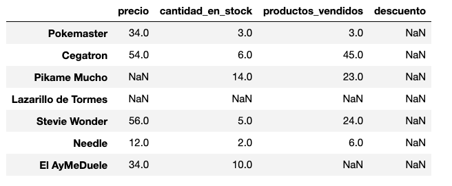
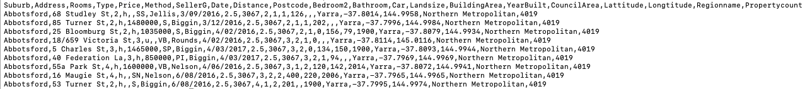
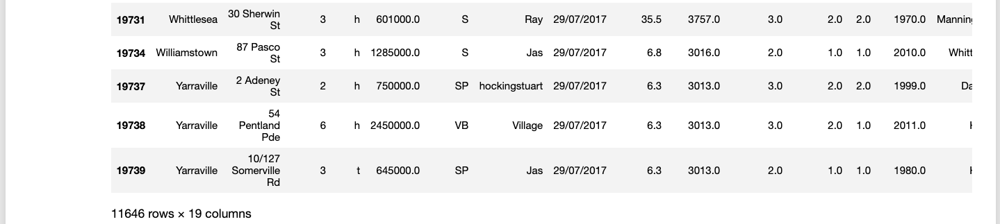
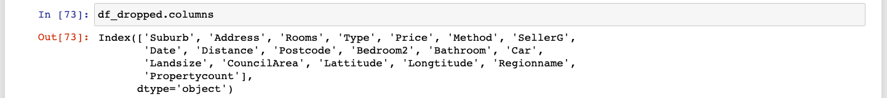

# Sesión 05: Funciones vectorizadas y limpieza de datos


<div style="text-align: justify;">

## 1. Objetivos

1. Identificar y utilizar las funciones vectorizadas.
2. Identificar agregaciones/reducciones.
3. Leer un CSV.
4. Encontrar y limpiar datos nulos.
5. Reindexar y cambiar el nombre de las columnas.

## 2. Contenido

---

### <ins>Introducción</ins>

El día de hoy vamos a aprender a limpiar un poco nuestros datasets. Necesitamos limpiar nuestros datasets para facilitarnos los procesos posteriores de análisis y visualización. Trabajar con un dataset sucio es muy difícil y frustrante.

Vamos a aprender a encontrar valores nulos en nuestro dataset y limpiarlos.

Pero para poder hacer esto, primero vamos a aprender dos herramientas que se llaman <u>funciones vectorizadas</u> y <u>agregaciones</u> que expandirán tus posibilidades muchísimo.

---

### <ins>Aritmética de series y funciones vectorizadas</ins>

`map` nos permite aplicar una función a una lista elemento por elemento. Hay una manera todavía más fácil de aplicar este tipo de procesos a una serie gracias a la aritmética con series y a las funciones vectorizadas. Aplicar una transformación es tan fácil como esto:

```python
serie = pd.Series([1,2,3,4,5])
serie * 5
```
```
0    5
1   10
2   15
3   20
4   25
dtype: int64
```

Vamos a ver cómo es que funcionan.

- [**`Ejemplo 1`**](Ejemplo-01/README.md)
- [**`Reto 1`**](Reto-01/README.md)

---

### <ins>Agregaciones</ins>

Las <u>agregaciones</u> son una variación de las funciones vectorizadas. Lo que hacen es tomar un arreglo (una serie, por ejemplo), aplicar una operación a todos los elementos y regresar un resultado único que es la agregación o reducción del arreglo. Una agregación se ve así:

```python
serie = pd.Series([1,2,3,4,5])
serie.sum()
```
```
15
```

Exploremos un poco.

- [**`Ejemplo 2`**](Ejemplo-02/README.md)
- [**`Reto 2`**](Reto-02/README.md)

---

### <ins>Funciones vectorizadas y agregaciones con DataFrames</ins>

También podemos aplicar estas herramientas a DataFrames completos. Tanto las operaciones aritméticas, funciones vectorizadas y agregaciones funcionan con ligeras diferencias de procedimiento.

```python
df * 100
```
```
                     precio  cantidad_en_stock productos_vendidos
Pokemaster           3400    300               300
Cegatron             5400    600               4500
Pikame Mucho         22300   100               2300
Lazarillo de Tormes  7800    299               7600
```

- [**`Ejemplo 3`**](Ejemplo-03/README.md)
- [**`Reto 3`**](Reto-03/README.md)

---

### <ins>NaN o Valores Nulos</ins>

Como viste en tu Prework, los valores `NaN` (Not a Number) son bastante indeseables porque no podemos utilizarlos para realizar análisis estadístico u operaciones aritméticas. Es por eso que uno de los primeros pasos en la Limpieza de Datos suele ser la eliminación de estos valores.

Los `NaNs` se ven así en un `DataFrame`:

<div style="padding: 10px; margin: 20px"></div>

Vamos a ver primero cómo identificarlos.

- [**`Ejemplo 4`**](Ejemplo-04/README.md)

---

### <ins>Limpiando `NaNs`</ins>

Hay 3 operaciones básicas que podemos realizar para eliminar `NaNs` de nuestros datasets:

1. Eliminar filas con `NaNs`
2. Eliminar columnas con `NaNs`
3. Llenar los `NaNs` con algún valor.

Exploremos las 3 opciones.

- [**`Ejemplo 5`**](Ejemplo-05/README.md)
- [**`Reto 4`**](Reto-04/README.md)

---

### <ins>Aplicando nuestros conocimientos a un dataset real</ins>

¡Vamos a ver un pequeño ejemplo donde vamos a aplicar lo que hemos visto el día de hoy a un dataset real!

Este dataset está en formato CSV, que quiere decir que cada columna está separada por una `coma`. Las líneas de nuestro archivo .csv son cada una las filas de nuestro dataset, y los datos en cada fila, separados por comas (`,`), conforman las columnas:

<div style="padding: 10px; margin: 20px"></div>

- [**`Ejemplo 6`**](Ejemplo-06/README.md)

---

### <ins>Reindexando y renombrando columnas</ins>

Tenemos ahora un dataset que ha sido limpiado de `NaNs`. Tenemos ahora dos problemas. El primero es que nuestro índice no corresponde al número de filas que tenemos ahora:

<div style="padding: 10px; margin: 20px"></div>

El segundo es que los nombres de nuestras columna son muy inconsistentes (e incluso contienen errores ortográficos):

<div style="padding: 10px; margin: 20px"></div>

Para terminar esta sesión, vamos a arreglar esos problemas.

- [**`Ejemplo 7`**](Ejemplo-07/README.md)
- [**`Reto 5`**](Reto-05/README.md)

---

### 3. Postwork

[**`Postwork Sesión 5`**](Postwork/Readme.md)
